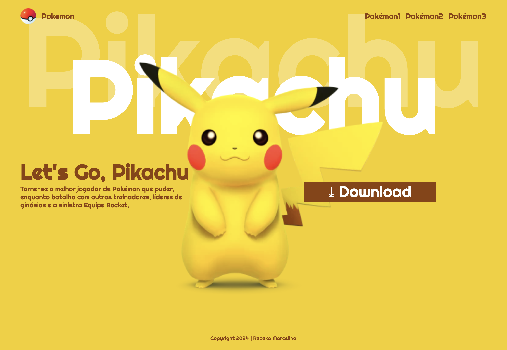

# Lading Page - Let's Go, Pikachu

---

## Sobre
Site do tipo landing Page para divulgar o jogo Let's Go, Pikachu. O intuito deste projeto é colocar em prática o conhecimento adquirido sobre as linguagens de marcação, HTML, CSS e Markdown, realizadas no curso técnico de Desenvolvimento de Sistemas do [SENAI Jandira](https://sp.senai.br/unidade/jandira/)
---

## Tecnologias utilizadas
- HTML
- CSS 
- Markdonw
- Git

---

## Autor

- [Rebeka Marcelino do Prado](https://www.linkedin.com/in/rebeka-marcelino-do-prado-436503327/)# Let-s-Go
# Let-s-Go
# Let-s-Go
# Let-s-Go
